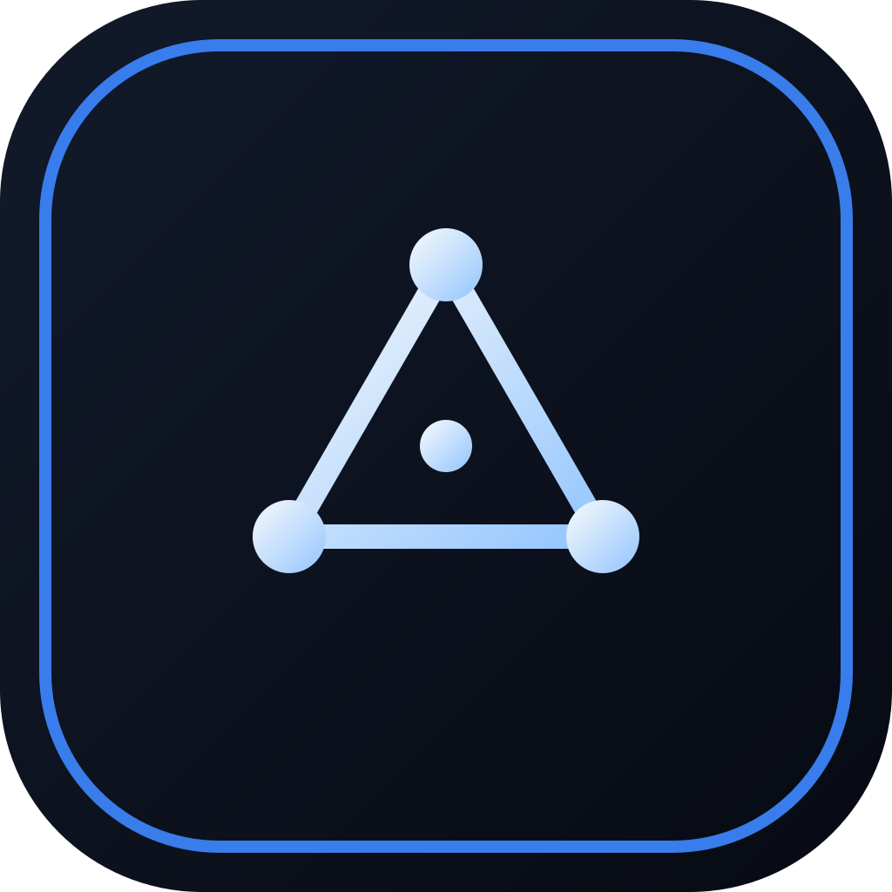

  

<h1 align="center">Nox Core</h1>
<h3 align="center">The Ultimate Anti-Detection Browser</h3>

  
  
  

  Manage hundreds of isolated browser profiles with unique fingerprints. 
  <b>100% local. Zero telemetry. Undetectable.</b>

  <a href="https://www.nox-core.com"><b>Try Free for 3 Days</b></a>

---

## What is Nox Core?

Nox Core is a professional anti-detection browser built for users who need to manage multiple online identities safely and efficiently.

Each browser profile runs in complete isolation — its own fingerprint, proxy, cookies, and session data. Nothing is shared between profiles, and nothing leaves your machine.

---

## Features

**Profile Management**
- Unlimited isolated browser profiles
- Bulk creation with unique auto-generated fingerprints
- Persistent sessions (cookies, storage, history)
- Import/export with encrypted backups
- Quality scoring and coherence verification

**Advanced Anti-Detection**
- Proprietary fingerprint engine — passes all major detection tests
- Human behavior simulation for reduced CAPTCHA triggers
- Anti-automation detection bypass
- Built-in ad and tracker blocking

**IP Intelligence**
- 3 fraud scores checked in parallel — no other browser does this
- 56 real-time blacklist (RBL/DNSBL) checks
- Automatic proxy type classification
- ISP and ASN identification
- Live latency measurement

**Proxy System**
- SOCKS5 with full authentication
- Zero DNS leaks — all resolution on proxy side
- Reusable proxy library
- One-click proxy testing and verification

**Security**
- AES-256-GCM encryption at rest
- OS keychain integration
- WebRTC leak protection
- All data stored locally — no cloud, no sync, no accounts

**Built-in Tools**
- 2FA/TOTP manager (Google Authenticator compatible)
- Privacy diagnostic per profile
- 11 languages supported

---

## Why Choose Nox Core?

| | **Nox Core** | Others |
|---|:---:|:---:|
| Price | **$50/mo** | $49–$99/mo |
| Unlimited profiles | **Yes** | 100–300 max |
| Data storage | **100% local** | Cloud-based |
| 3 parallel fraud scores | **Yes** | No |
| 56 RBL checks | **Yes** | No |
| Human behavior simulation | **Yes** | No |
| Built-in 2FA | **Yes** | No |
| Ad/tracker blocking | **Yes** | No |
| Zero telemetry | **Yes** | No |
| macOS + Windows + Linux | **Yes** | Partial |

---

## Pricing

| Plan | Duration | Price |
|---|---|---|
| **Free Trial** | 3 days | **$0** |
| Monthly | 30 days | $50 |
| Quarterly | 90 days | $150 |
| Semi-Annual | 180 days | $300 |
| Annual | 365 days | $600 |

All plans include unlimited profiles, all features, all platforms.

---

## Download

Available for **macOS** (Intel & Apple Silicon), **Windows** (x64), and **Linux** (x64, ARM64).

Download from the [Releases](https://github.com/noxcore-browser/nox-core/releases) page or from [nox-core.com](https://www.nox-core.com).

---

## Support

- [nox-core.com](https://www.nox-core.com)
- contact@nox-core.com

---

  <a href="https://www.nox-core.com"><b>www.nox-core.com</b></a>

